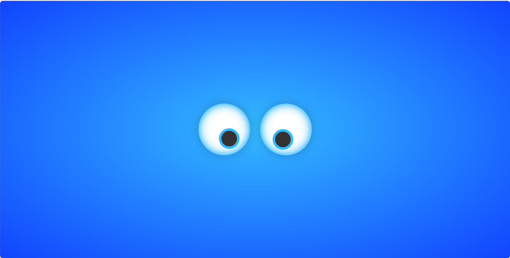
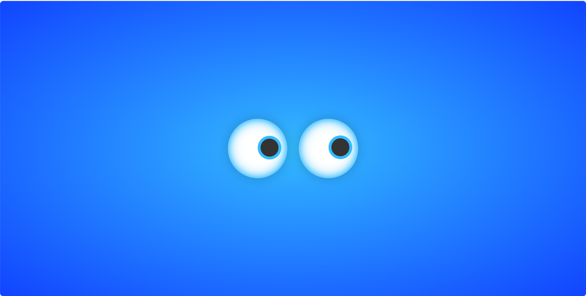

## 转动眼珠 

实现一个眼珠随鼠标转动的页面

 

## 项目功能

页面中眼珠随鼠标移动而转动

## 项目信息

- 绘制基本页面，设置样式、位置
- 用::before定义眼珠，设置其样式和初始位置
- js实现原理：通过监听鼠标位置给眼睛设置对应的rotate角度
- addEventListener绑定鼠标移动事件
- forEach()方法为数组元素（两个眼睛）执行函数
- 由坐标→弧度→角度，再将旋转角度赋值给眼睛元素的 css 进行旋转
